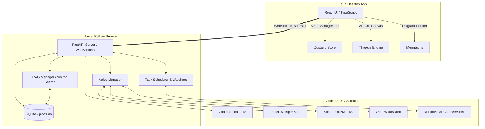

# 🤖 Jarvis - Intelligent Desktop Companion

Jarvis is a local, private, and fully offline intelligent desktop assistant built using **Tauri v2**, **React + TypeScript (Vite)**, and a robust **Python AI Backend**. It combines interactive AI chat, local voice intelligence, active system monitoring, and folder indexing (RAG) into a single unified desktop experience.

---

## 🚀 Key Features

* **💬 Smart Streaming Chat:** Chat in real-time with local LLMs (configured with `qwen3.5:9b` by default) via **Ollama**.
* **🗣️ Offline Voice System:**
  * **Wake Word Detection:** Activate Jarvis hands-free using **openwakeword** ("Hey Jarvis").
  * **High-Quality Speech Synthesis (TTS):** Beautiful, natural-sounding voice output powered by **Kokoro ONNX**.
  * **Local Transcription (STT):** Fast and accurate speech recognition powered by **Faster-Whisper**.
* **🔮 Neural Orb:** An interactive Three.js 3D orb that visualizes voice states (listening, thinking, speaking) with smooth animations.
* **📂 Local Knowledge RAG (Retrieval-Augmented Generation):** Index your local directories to let Jarvis retrieve and answer questions based on your files.
* **📋 Active System Monitoring:**
  * **Clipboard Monitor:** Real-time Windows clipboard tracking with prompt toast alerts.
  * **Screen Memory Monitor:** Periodically logs active window telemetry to capture contextual workflows.
* **📅 Automation Scheduler & Watchers:** Schedule jobs or trigger customized scripts dynamically on file system modifications.
* **🖥️ OS Telemetry:** Live hardware diagnostics (CPU usage, GPU name, RAM footprint, Disk space) displayed in the interface.

---

## 🏗️ Architecture



---

## ⚙️ Prerequisites

Ensure you have the following installed on your machine:
* **Node.js** (v18 or higher)
* **Python** (v3.10 or higher)
* **Rust & Cargo** (Required to compile the Tauri bridge)
* **Ollama** (Running locally with the default model pulled):
  ```bash
  ollama pull qwen3.5:9b
  ```

---

## 🏁 Getting Started

### 1. Set Up the Python Backend

1. Navigate to the `backend/` directory:
   ```bash
   cd backend
   ```
2. Create and activate a Python virtual environment:
   ```bash
   python -m venv .venv
   # On Windows:
   .venv\Scripts\activate
   # On macOS/Linux:
   source .venv/bin/activate
   ```
3. Install the required dependencies:
   ```bash
   pip install -r requirements.txt
   ```
4. Start the backend server:
   ```bash
   python main.py
   ```
   > [!NOTE]
   > On the very first startup, the backend will automatically download the required Kokoro TTS models (`kokoro-v1.0.onnx` and `voices-v1.0.bin`) into `backend/models/`. Please allow a moment for this to complete.

### 2. Set Up the Tauri Frontend

1. Return to the project root directory.
2. Install the frontend dependencies:
   ```bash
   npm install
   ```
3. Launch Jarvis in development mode:
   ```bash
   npm run tauri dev
   ```

---

## 🛠️ Configuration

You can customize the voice parameters, wake word settings, and LLM configuration directly in [backend/config.py](file:///c:/Users/houst/Desktop/Projects/New%20Jarvis/backend/config.py):

* `MODEL_NAME`: Set the Ollama model (e.g., `qwen3.5:9b`, `llama3`).
* `OLLAMA_OPTIONS`: Configure the context length and quantization cache.
* `TTS_VOICE_DEFAULT`: Set the speaker voice accent (e.g., `bm_george` for British Male).
* `SILENCE_THRESHOLD` & `SILENCE_DURATION`: Tune Voice Activity Detection (VAD) sensitivity.

